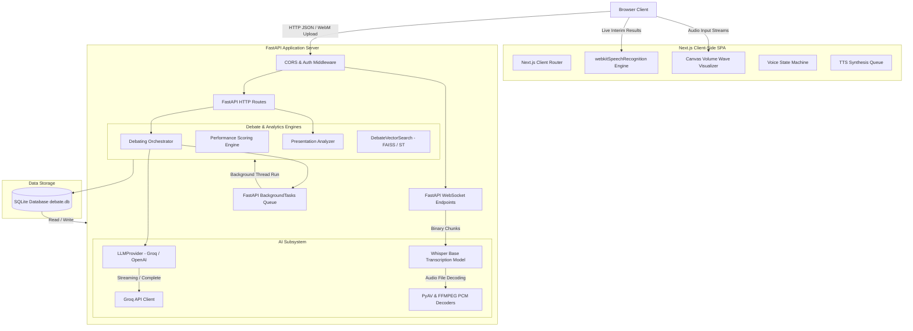
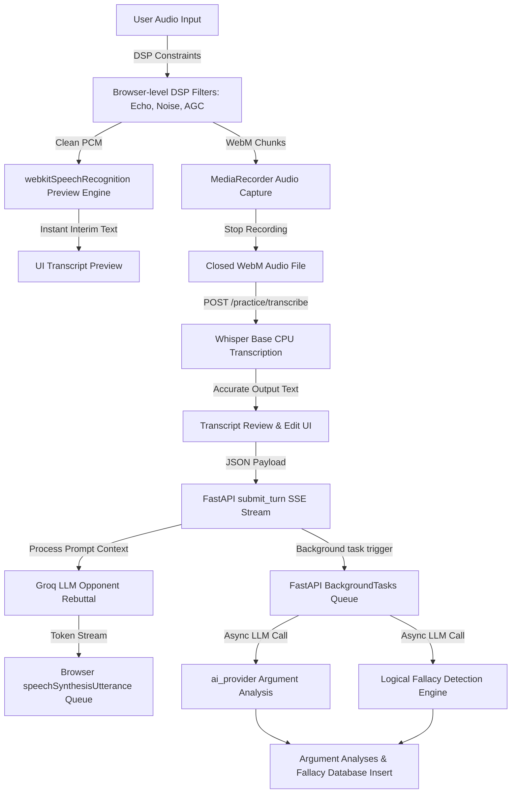
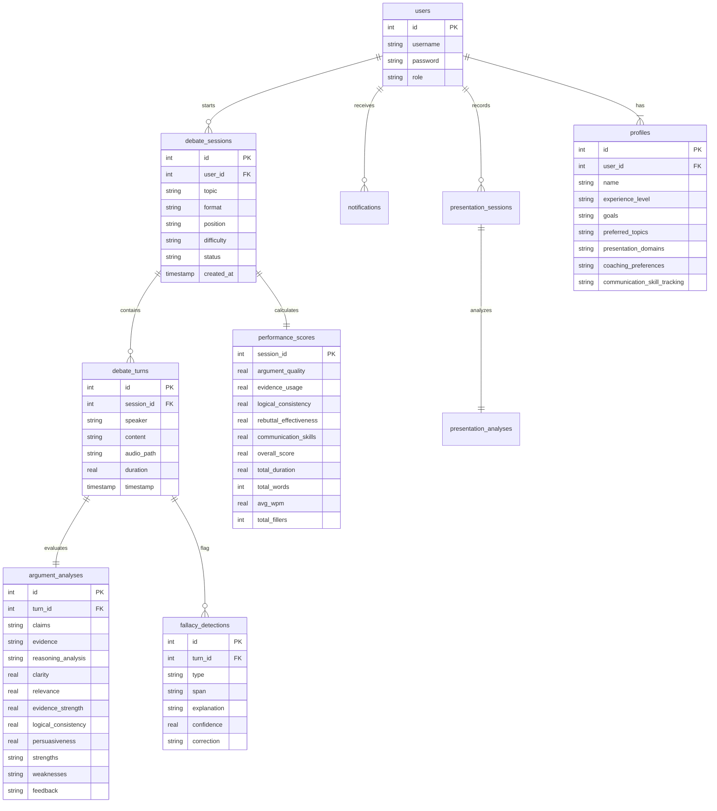

# Technical Architecture & System Documentation

## System Architecture




---

## Detailed AI Pipeline



---

## Complete Technology Stack

| Component | Technology | Rationale | Alternatives Considered | Advantages | Limitations |
|---|---|---|---|---|---|
| **Frontend Framework** | **Next.js** | Provides routing, Server-Side Rendering (SSR) support, and simplified static site export capability. | React SPA (Vite) | Simplified routes, fast dev server, framework structure. | Large node_modules weight. |
| **Frontend Styling** | **Vanilla CSS & TailwindCSS** | Used for layout and styling (e.g. dark dashboard views). | Styled Components | Highly responsive, easy custom tokens. | Requires build integration. |
| **Backend Framework** | **FastAPI** | High-performance ASGI Python framework supporting native JSON schema validation and SSE streams. | Flask, Django | Extremely fast, automatic OpenAPI docs generation. | Minimal built-in admin UI. |
| **Audio Processing** | **FFmpeg & PyAV** | Raw PCM audio resamplers and container decoders for WebM files. | pydub | High performance, handles standard browser audio codecs. | Complicated OS dependency setup. |
| **AI Inference** | **Groq & Whisper** | Rapid LLM completions (`llama-3.3-70b-versatile`) and highly accurate local Whisper speech-to-text. | OpenAI Cloud | Sub-second latency for LLM responses; zero-cost local transcription. | High local CPU utilization during Whisper transcription. |
| **Database** | **SQLite (debate.db)** | Embedded SQL database for local workspaces. | PostgreSQL | Zero configuration, fast read/write, file-based. | Not suitable for highly parallel multi-node writes. |

---

## Folder Structure

```
E:/Debate-Coach-Presentation-Analysis/
├── main.py                    # Main FastAPI Application server, houses REST endpoints & CORS middlewares
├── database.py                # Database connection factory (get_db) & SQLite Schema definitions
├── models.py                  # Pydantic schemas validating API Request/Response models
├── auth.py                    # Cryptographic context (bcrypt) and JWT Token signing routines
├── dependencies.py            # FastAPI depends functions for current user extraction and role check validation
├── debate_agent.py            # DebateOrchestrator managing session state transitions, turn histories, and prompt packaging
├── counterargument.py         # AI Opponent completion service configuring strategy and difficulty modifiers
├── argument_analysis.py       # Debate evaluation service scoring user arguments (clarity, relevance, persuasion) via LLM
├── fallacy_detector.py        # Logical fallacy scanner scanning speech structures for circular reasoning, straw man, etc.
├── presentation_service.py    # Standalone oral analysis engine scoring speech pacing (WPM) and filler densities
├── notifications_service.py   # Database notification logger triggering learners' achievements and reminders
├── scoring.py                 # Weighted scoring formula processor calculating overall debate metrics (0-100)
├── vector_search.py           # FAISS & SentenceTransformers semantic similarity engine with TF-IDF fallback
├── reports_export.py          # PDF (ReportLab) & Excel (OpenPyXL) exporter for session transcripts
└── frontend/                  # Next.js workspace root
    ├── package.json           # Node application scripts and dependencies
    └── src/
        ├── app/               # Page routing folder (dashboard, practice, presentation, progress)
        ├── components/        # Reusable dashboard widgets, charts, and navigation sidebars
        └── lib/               # Shared javascript helper files (API clients)
```

---

## Database Design



---

## Role-Based Access Control

### Permissions Matrix

| Access Role | View Analytics | Register Debate | Manage System Users | Review Learners | Export System Reports |
|---|---|---|---|---|---|
| **Learner** | Yes (Personal) | Yes | No | No | No |
| **Coach** | Yes (Assigned) | Yes | No | Yes | No |
| **Educator**| Yes (Overview) | Yes | No | Yes | Yes |
| **Admin** | Yes (Full) | Yes | Yes | Yes | Yes |

### Protected Routes (Dependencies Validation)

- **`/admin/*`**: Access restricted using `require_role(["Admin"])` dependency.
- **`/educator/*`**: Access restricted using `require_role(["Educator", "Admin"])` dependency.
- **`/coach/*`**: Access restricted using `require_role(["Coach", "Educator", "Admin"])` dependency.
- **`/practice/*`** & **`/profile/*`**: Access restricted to logged-in users via `get_current_user` JWT validation.

---

## API Endpoints Documentation

### Authentication & Profiles

- **`POST /register`**: Registers a new user. Returns user details.
- **`POST /login`**: Validates credentials. Returns signed JWT Token.
- **`GET /profile`**: Retrieves logged-in user profile details.
- **`PUT /profile`**: Modifies user preferences (experience, topics, domains).

### Debate Practice Room

- **`POST /practice/start`**: Creates a new debate session. Returns `session_id`.
- **`GET /practice/sessions/{session_id}`**: Retrieves metadata and detailed turns list (including analysis and fallacies).
- **`POST /practice/sessions/{session_id}/turn`**: Submits a user argument (supports streaming SSE responses and background tasks).
- **`GET /practice/turns/{turn_id}/analysis`**: Fetches asynchronous coaching analysis results once background LLM calls complete.
- **`POST /practice/sessions/{session_id}/end`**: Stops the session and calculates overall performance scores.
- **`POST /practice/transcribe`**: Accepts a WebM audio upload and transcribes it using Whisper.

### Presentation Analyzer & Exporters

- **`POST /presentation/upload`**: Evaluates presentation audio, returning PACE (WPM) and filler word analytics.
- **`GET /reports/export/{session_id}/pdf`**: Generates a PDF evaluation report of the debate session.
- **`GET /reports/export/{session_id}/excel`**: Exports performance scores to a spreadsheet.

---

## Configuration & Deployment

### Environment Variables (.env)
- `DATABASE_URL`: Location of database (e.g. `sqlite:///debate.db`).
- `SECRET_KEY`: Cryptographic signing key for JWT tokens.
- `LLM_PROVIDER`: Completion driver (`groq` or `openai`).
- `GROQ_API_KEY`: API access token for Groq.
- `GROQ_MODEL`: Core model name (`llama-3.3-70b-versatile`).

### Docker Deployment
Build and start the application instantly using docker-compose:
```bash
docker-compose up --build
```
This starts:
1. **FastAPI Server** on port `8000`.
2. **Next.js SPA** on port `3000`.
