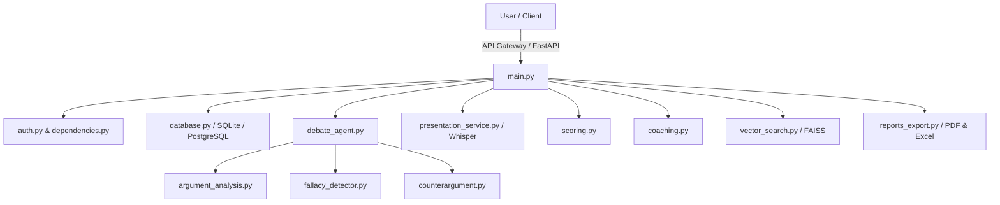

# Agentic AI Debate Coach & Presentation Analysis Platform

An AI-powered Debate Coaching and Presentation Intelligence Platform that evaluates arguments, detects logical fallacies, calculates communication metrics, generates counterarguments, and provides personalized coaching feedback.

## Architecture



## Features

- **JWT Authentication & RBAC**: Roles for Learner, Debate Coach, Educator, and Administrator.
- **Onboarding Form**: Setup experience, custom interests, and skills targets.
- **AI Arena**: Practice room with real-time argument analysis, fallacy popups, and turn progression.
- **Weighted Scoring**: Strict mathematical evaluation based on five key dimensions.
- **Speech metrics**: Estimates pace, fillers (um/uh), confidence, and clarity.
- **Exports**: Instant high-fidelity PDF/Excel reports of sessions.

## Setup Instructions

### Local Development Setup

1. **Install Python and Node.js Dependencies**
   ```bash
   # Backend
   .infosys\Scripts\pip install -r requirements.txt
   
   # Frontend
   cd frontend
   npm install
   ```

2. **Run Schema Migrations**
   ```bash
   .infosys\Scripts\python database.py
   ```

3. **Start FastAPI Backend Server**
   ```bash
   .infosys\Scripts\uvicorn main:app --reload --port 8000
   ```

4. **Start Next.js Frontend Dev Server**
   ```bash
   cd frontend
   npm run dev
   ```

### Docker Compose Run (Production Target)
```bash
docker compose up --build
```

- Backend Gateway: `http://localhost:8000`
- API Documentation (Swagger): `http://localhost:8000/docs`
- Interactive User Workspace: `http://localhost:3000`

## System Testing
```bash
$env:PYTHONPATH="E:\Debate-Coach-Presentation-Analysis" ; .infosys\Scripts\pytest tests/test_debate.py
```
